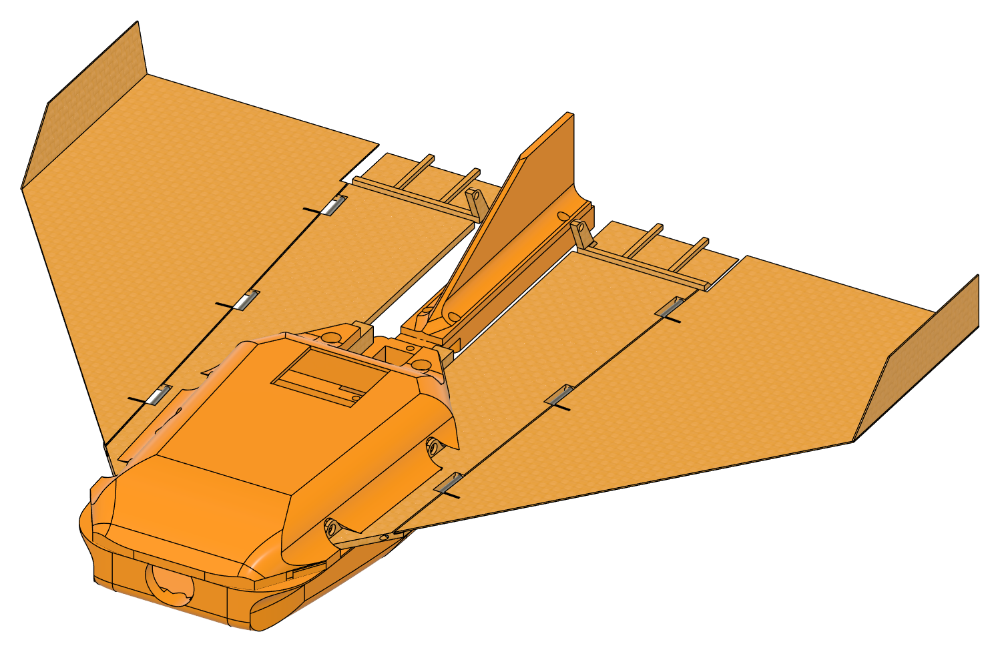
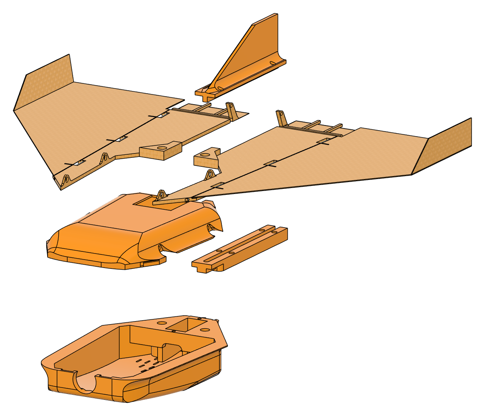
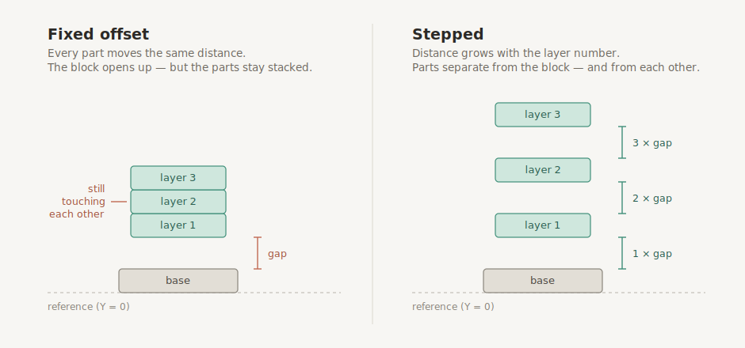
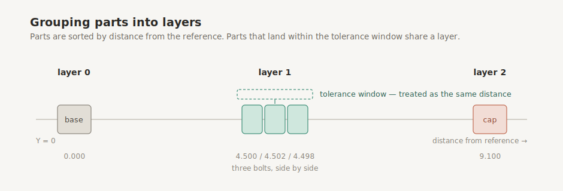
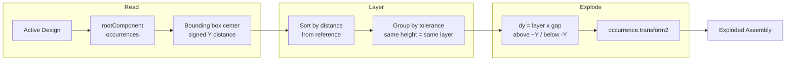

# fusion360-exploded-view
 
A Fusion 360 add-in that builds exploded views automatically. Instead of pushing every part the same distance, it groups parts into layers by how far they sit from the reference and spaces them **progressively** — so parts separate from each other, not just from the block.
 
<table>
  <tr>
    <td align="center"><b>Before</b></td>
    <td align="center"><b>After</b></td>
  </tr>
  <tr>
    <td></td>
    <td></td>
  </tr>
</table>
---
 
## Features
 
- Adds an **EXPLODED VIEW** tab to the Design toolbar, alongside SOLID, SURFACE and MESH.
- Reads the open assembly and measures each component's position from its **bounding box center**, not its transform — so a part's local origin can sit anywhere without breaking the result.
- Groups parts into **layers** by distance from the reference:
  - Parts at effectively the same height (side-by-side bolts, for example) share a layer and are never fanned out into a staircase.
  - Grouping uses a tolerance, since floating-point positions are never exactly equal.
- Explodes **progressively**, not by a fixed offset:
  - Layer 1 → `1 × gap`
  - Layer 2 → `2 × gap`
  - Layer 3 → `3 × gap`
- Parts above the reference move **up**, parts below move **down**, so the result reads like an assembly order.
- The gap is entered by the user in a dialog at run time — nothing is hardcoded.
---
 
## How It Works
 
Most quick explode scripts translate every component by a fixed offset. The assembly moves away from itself, but the parts stay stacked relative to one another — which defeats the purpose of an exploded view.
 

 
Distance from the reference decides the **layer**, the layer decides how far the part travels, and the sign decides which way. Parts sitting at effectively the same height share a layer, so side-by-side bolts are never fanned out into a staircase.
 

 

 
The reference is the origin plane (`Y = 0`). Everything is positioned relative to it.
 
---
 
## Project Structure
 
```
.
├── Exploded View.py         # Add-in entry point. run() / stop() lifecycle, toolbar setup
├── Exploded View.manifest   # Add-in metadata read by Fusion
├── config.py                # IDs, workspace target, default gap and tolerance
├── AddInIcon.svg            # Toolbar button icon
├── commands/                # Command definitions, dialog inputs and event handlers
├── lib/                     # Explode logic: measuring, sorting, layering, transforms
├── docs/                    # Diagrams and screenshots used in this README
└── .gitignore               # Isolates .env, __pycache__, editor files from git
```
 
---
 
## Setup & Execution
 
**1. Install the add-in**
 
Copy this folder into your Fusion add-ins directory:
 
- **Windows** — `%APPDATA%\Autodesk\Autodesk Fusion 360\API\AddIns\`
- **macOS** — `~/Library/Application Support/Autodesk/Autodesk Fusion 360/API/AddIns/`
The folder name and the `.py` file name must match. Fusion requires this.
 
**2. Load it in Fusion**
 
Go to **Utilities → Scripts and Add-Ins → Add-Ins**, select the add-in, and click **Run**. Tick *Run on Startup* to load it every session.
 
**3. Run the command**
 
Open an assembly in the **Design** workspace, then:
 
```
EXPLODED VIEW tab  →  Exploded View button  →  enter gap (e.g. 10 mm)  →  OK
```
 
Use `Ctrl+Z` / `Cmd+Z` to collapse the assembly back.
 
---
 
## Notes and Limitations
 
- **Y axis only.** Explosion happens along a single axis; radial and multi-axis explosion are not implemented.
- **Top-level components only.** Nested sub-assemblies are not traversed; their contents move as one unit.
- **Jointed components** may resist repositioning, since their placement is driven by the joint rather than a free transform.
- Fusion's internal unit is **centimeters**. The dialog accepts millimeters and converts.
---
 
## License
 
MIT — see [LICENSE](LICENSE).
 
